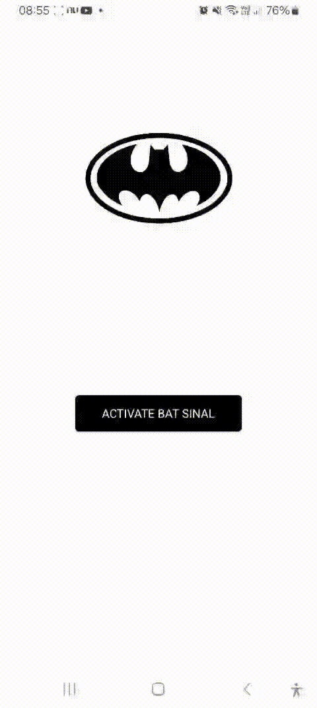

<div align="center">
  <a href="#">
      
  </a>

  <h1 align="center">Bat-Signal App</h1>

  <p align="center">
    An app to trigger the Bat-Signal.
    <br />
    <a href="https://github.com/ismaelldiias/react-native-bat-signal-app/issues">Report Bug</a>
    ·
    <a href="https://github.com/ismaelldiias/react-native-bat-signal-app/issues/new">Request Feature</a>
  </p>
</div>

## 📌 About the Project

This app was originally created as part of the **React Native Developer Training** by [Digital Innovation One (DIO)](https://www.dio.me/).

The instructor [Felipe Aguiar](https://github.com/felipeAguiarCode) provided a briefing with the challenge of **developing the mobile interface for a Bat-Signal application using React Native**, allowing users to trigger and visualize the iconic Batman signal in an interactive and responsive way.

This personal enhancement changes the Bat-Signal logo background to yellow once the user fills out and submits the form, providing a clearer visual indication that the signal has been activated.

## 👀 Preview

<div align="center">
  <a href="#">
      
  </a>
</div>

## 🔥 Features

- [x] Interactive Bat-Signal button with status indication
- [x] Form screen to collect user data
- [x] **(Improvement)** Yellow background behind the logo when activated

## 🛠 Technologies

- [React Native](https://reactnative.dev/)
- [Expo](https://docs.expo.dev/)

## 🚀 Building

You'll need [Node.js](https://nodejs.org) installed on your computer in order to build this app.

```bash
git clone https://github.com/ismaelldiias/react-native-bat-signal-app.git
$ cd react-native-bat-signal-app
$ npm install
$ npm run start
```

## 📱 Usage

🔧 Run the script

```bash
$ npm run start
```

Runs the app in the development mode.<br/>

## ✨ Author

| Original Author |
|:---------------:|
| [<br><sub>Ismael Dias</sub>](https://github.com/ismaelldiias)<br>[LinkedIn](https://www.linkedin.com/in/ismaelldiias/) |

